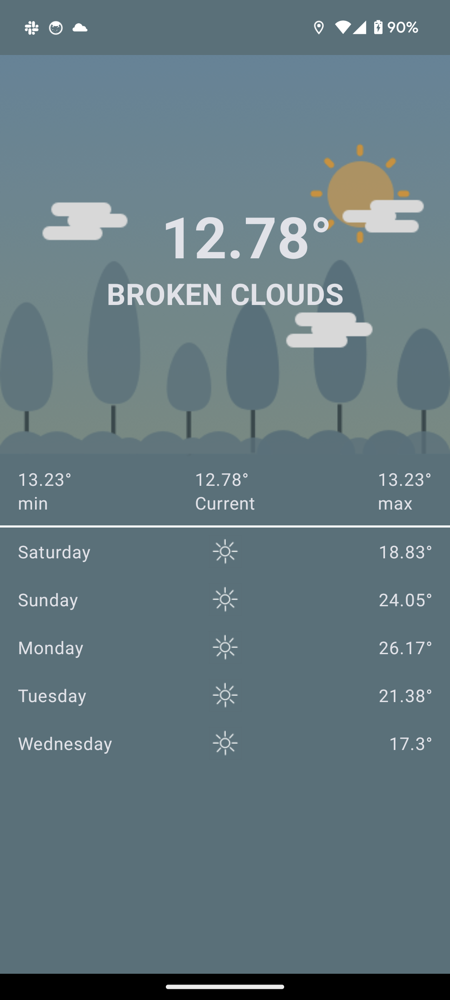

# Weather-App

A weather application to display the current weather at the user’s location and a 5-day forecast.

Requirements:

1. You are required to implement the Forest design provided.
2. The forecast must be based on the user’s current location.
3. The application should connect to the following API to collect the weather information.
    1. https://openweathermap.org/current
    2. https://openweathermap.org/forecast5
4. You will be required to change the background image depending on the type of weather(Cloudy,
   Sunny and Rainy). Please use the provided assets and icons.

## Architecture

Clean Architecture

## Project Structure

Project is modularized by features, it has the following modules

- app
    - Glues other modules together, contains app entry point class
- forecast
    - Contains all forecast related functionality i.e fetch current and 5 day forecast
- favourites
    - Enable marking favourites forecasts
    - Display favourite forecasts
- location
    - Fetch current location
    - Fetch location details e.g latitude, longitude, name
- Network
    - Common network configuration classes

For easy readability the packages are arranged in a "screaming" manner i.e 'what' the the program
does is displayed in the package
arrangement and as you move deeper into the package the framework details are grouped in:

- Data
    - Handles data retrieval and storage, contains both remote and local sources of data
- Domain
    - Contains pure business logic, and functions that can be done represented as usecases.
- Presentation
    - Contains classes dealing with user interface loading.

## Libraries

* [Ktlint](https://pinterest.github.io/ktlint/latest/)  a linting tool used for formatting Kotlin
  code.
* [Ktlint Gradle Plugin](https://github.com/jlleitschuh/ktlint-gradle) provides a convenient wrapper
  plugin over the ktlint project.
* [Retrofit](https://square.github.io/retrofit/) A type-safe HTTP client for Android and Java
* [Coil](https://coil-kt.github.io/coil/) An image loading library for Android backed by Kotlin
  Coroutines.
* [Timber](https://jakewharton.github.io/timber/docs/5.x/) a logger with a small, extensible API
  which provides utility on top of Android's normal Log class.
* [Okhttp Interceptor](https://square.github.io/okhttp/features/interceptors/)  a powerful mechanism
  that can monitor, rewrite, and retry calls.
* [Room](https://developer.android.com/training/data-storage/room)  an android persistence library
  that provides an abstraction layer over SQLite to allow fluent database access while harnessing
  the full power of SQLite
* Reactive programming (with [Kotlin Coroutines andKotlin Flows](https://kotlinlang.org/docs/reference/coroutines/flow.html))
* Google [Material 3](https://m3.material.io/) library

## CI/CD

Github actions

## Sample Screens

  |  |  
--------------------------------|-------------------------------------|------------------------------------------
 **Cloudy**                     | **Sunny**                           | **Rainy**                                

## App Access

[Download Weather App](https://drive.google.com/drive/folders/1aoOwCX44ZIJgqekw5CFH_RifirvJQj3Z?usp=sharing)
